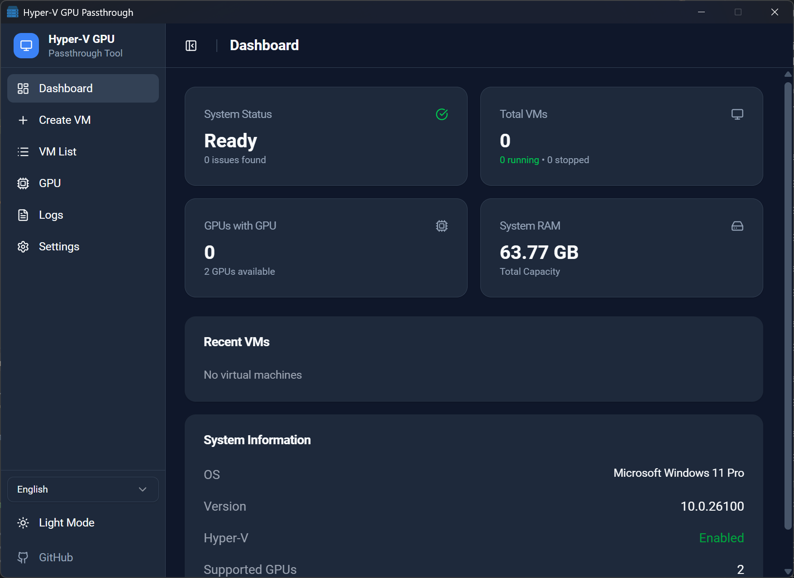

# Hyper-V GPU Passthrough Tool

This project provides a user-friendly interface for managing Hyper-V Virtual Machines with GPU Passthrough capabilities. It simplifies the process of creating, managing, and connecting to VMs that require direct GPU access.

**Inspired by and related to the [easy-gpu](https://github.com/jamesstringerparsec/Easy-GPU-PV) project.**



## Features

- **Dashboard**: Overview of your virtual environment.
- **VM Management**: Create, Start, Stop, and Delete VMs.
- **GPU Passthrough**: Easily assign GPUs to your VMs with partitioning support.
- **Multi-language Support**: English, Vietnamese, Chinese, Japanese, Russian.
- **Remote Desktop**: One-click connection to your VMs.
- **Logs**: meaningful logs for troubleshooting.

## Installation

1.  Clone the repository.
2.  Install dependencies:
    ```bash
    npm install
    ```
3.  Run the application in development mode:
    ```bash
    npm run tauri dev
    ```
4.  Build for production:
    ```bash
    npm run tauri build
    ```

## Usage

### Prerequisites

- **OS**: Windows 10/11 Pro or Enterprise.
- **Hyper-V**: Must be enabled in Windows Features.
- **GPU**: A supported GPU (e.g., NVIDIA GeForce/Quadro) and drivers capable of GPU-PV.

### Running the App

It is recommended to run the application as **Administrator** to ensure it has the necessary permissions to execute Hyper-V PowerShell commands.

### Creating a VM

1.  Navigate to the **Create VM** tab.
2.  Enter a name for your new Virtual Machine.
3.  (Optional) Select an ISO file if you wish to install an OS immediately.
4.  Click **Create**. The tool will run the necessary scripts to set up the VM.

### Configuring GPU Passthrough

1.  Go to the **VM List** tab.
2.  Find the VM you want to configure.
3.  Click the **Settings** (Gear icon) button.
4.  In the configuration modal:
    - **Select GPU**: Choose the specific GPU you want to pass through, or leave it as "AUTO" to let the tool pick the best available one.
    - **GPU Resource**: Use the slider to allocate the percentage of GPU resources (VRAM, Compute, etc.) to this VM.
    - **CPU & RAM**: You can also adjust the CPU cores and RAM allocation here.
5.  Click **Update**.
    > **Note**: The VM will be forcibly stopped to apply these hardware changes.

### Connecting to the VM

1.  On the **VM List** tab, click **Start** (Play icon) to boot the VM.
2.  Wait for the status to change to **Running**.
3.  Click the **Connect Remote Desktop** (Monitor icon) button to launch an RDP session to the VM.

## Technologies Used

- **Frontend**: React, TypeScript, Tailwind CSS, Vite
- **Backend**: Rust (Tauri)
- **UI Components**: Radix UI, Lucide Icons

## License

MIT
